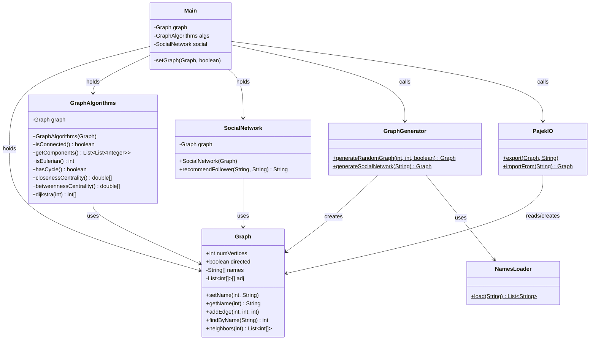
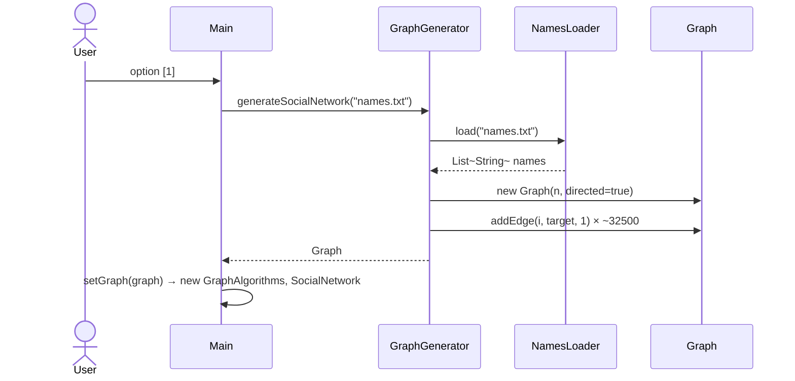
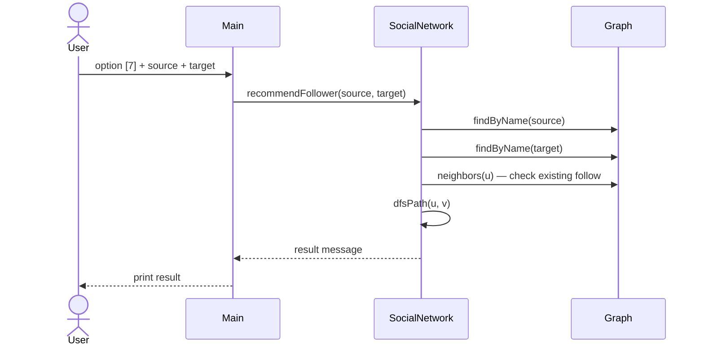

# Design

> Status: Active
> Authority: Tier 2 — Core Knowledge
> Last Updated: 2026-06-16
> Owner: Jafte Carneiro Fagundes da Silva

## System Overview

Console application that models a directed weighted social network as a graph and
exposes classic graph algorithms through an interactive menu.
No external graph libraries are used — pure Java (`java.util.*`).

---

## Component Architecture

```
graph/
├── model/       Pure data structure — no algorithms, no I/O
├── algorithm/   Graph algorithms operating on model.Graph
├── domain/      Social network business rules
├── io/          Pajek file format + name file loading
├── generator/   Random graph and social network construction
└── Main         Console UI — orchestration only
```

Dependency direction (no cycles):

```
Main → algorithm, domain, generator, io, model
algorithm  → model
domain     → model
generator  → model, io
io         → model
model      → (none)
```

---

## Class Design

### UML Class Diagram



---

## Data Flow

### Generate Social Network



### Follower Recommendation



---

## Design Decisions

### DD-01 — `GraphAlgorithms` as a stateful service (not static utility)

**Decision:** `GraphAlgorithms` takes `Graph` in the constructor rather than receiving
it as a parameter on every method call.

**Reason:** Avoids repeating the same argument on every call. The algorithms are
logically bound to a single graph instance during a session. Easier to extend with
caching in the future (e.g. memoising Dijkstra results).

---

### DD-02 — `adj` made private; read access via `neighbors(int u)`

**Decision:** The adjacency list is no longer directly accessible from outside `Graph`.
A read accessor `neighbors(u)` returns the live list.

**Reason:** Eliminates the tight coupling that allowed `GraphGenerator` and `PajekIO`
to bypass `addEdge` and write directly to the internal array. The live list is returned
(not a copy) for performance on the 5,000-node graph — callers must not mutate it.

---

### DD-03 — `print()` removed from `Graph` and inlined in `Main`

**Decision:** Presentation logic moved to `Main.printGraph()`.

**Reason:** A data structure class must not write to the console. `Graph` has no
knowledge of how it should be displayed; that is the responsibility of the UI layer.

---

### DD-04 — `numVertices` and `directed` remain public fields

**Decision:** Kept as `public final` and `public` respectively instead of adding getters.

**Reason:** Academic scope — the overhead of getters on primitives adds no value here.
Both fields are read-only in practice (`numVertices` is final; `directed` is only
mutated by `PajekIO` during import before the graph is returned).

---

## Performance Considerations

| Operation | Complexity | Notes |
|---|---|---|
| `isConnected` | O(V + E) | BFS on undirected view |
| `getComponents` | O(V + E) | BFS per component |
| `isEulerian` | O(V + E) | degree counting |
| `hasCycle` | O(V + E) | DFS coloring |
| `closenessCentrality` | O(V × (V + E) log V) | Dijkstra per vertex — warns user for V > 500 |
| `betweennessCentrality` | O(V × (V + E) log V) | Brandes + Dijkstra — warns user for V > 500 |
| `recommendFollower` | O(V + E) | DFS with path tracking |

The `undirectedNeighbors` helper used by connectivity algorithms is O(V + E) per call
due to the reverse-edge scan on directed graphs. For the 5,000-node network this is
acceptable for single calls but would be a bottleneck if called repeatedly.
