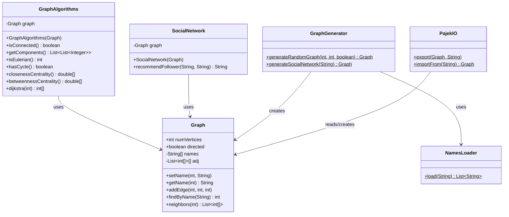
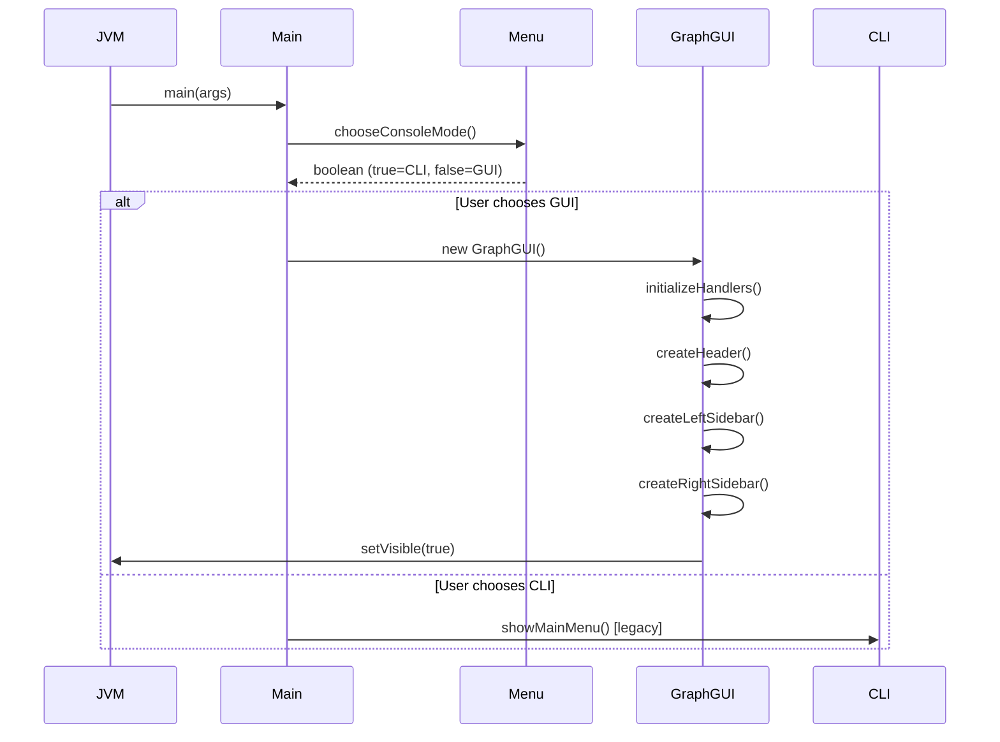
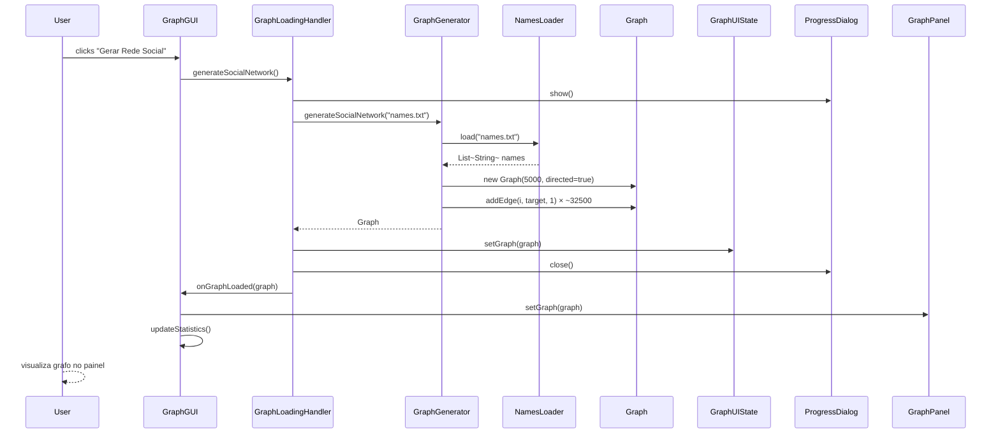
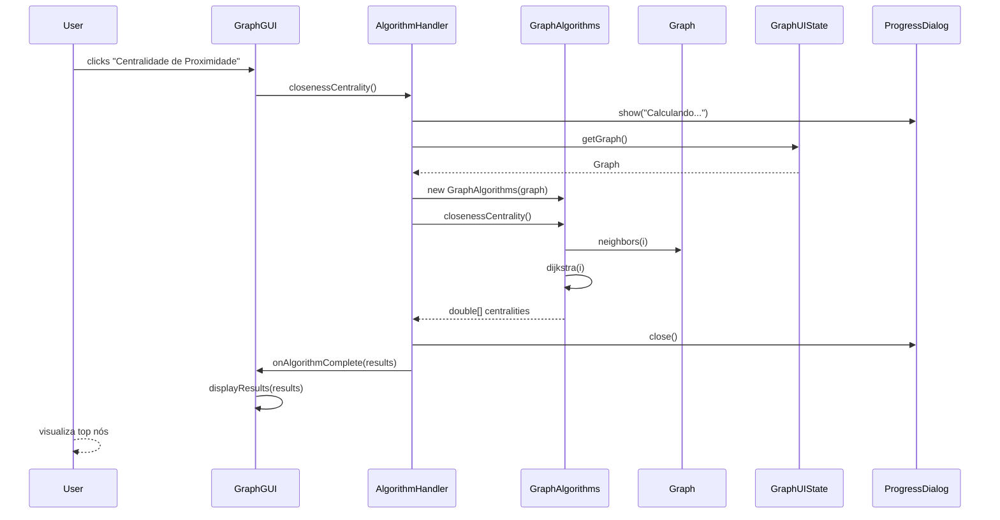
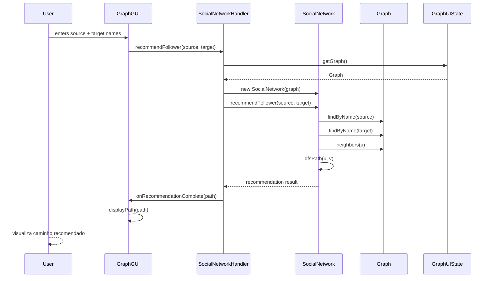
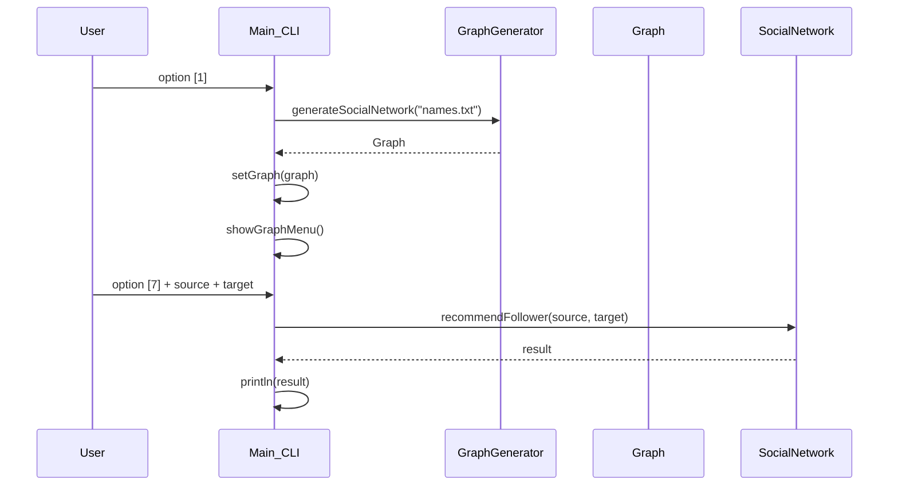

# Design

> Status: Active
> Authority: Tier 2 — Core Knowledge
> Last Updated: 2026-06-16
> Owner: Jafte Carneiro Fagundes da Silva

## System Overview

**GraphNet Analyzer** — Aplicação completa para análise de grafos de alta dimensionalidade com dois modos de execução:

1. **GUI (Graphical User Interface)** — Interface Swing moderna com visualização interativa de grafos
2. **CLI (Command-Line Interface)** — Interface console interativa (modo legado)

Ambos os modos operam sobre a mesma camada de domínio:
- Estrutura de dados pura (`Graph`)
- Algoritmos especializados (`GraphAlgorithms`)
- Regras de negócio (`SocialNetwork`)
- I/O (`PajekIO`, `NamesLoader`)

Nenhuma biblioteca externa de grafos é usada — **Java puro** (`java.util.*` + `javax.swing`).

---

## Component Architecture

```
graph/
├── model/
│   └── Graph.java              # Estrutura de dados pura
├── algorithm/
│   └── GraphAlgorithms.java    # 7 algoritmos + 7 helpers
├── domain/
│   └── SocialNetwork.java      # Lógica de recomendação
├── io/
│   ├── PajekIO.java            # Import/export Pajek
│   └── NamesLoader.java        # Carregamento de nomes
├── generator/
│   └── GraphGenerator.java     # Construção de grafos
├── gui/                        # ← NOVO: Interface gráfica
│   ├── GraphGUI.java           #   Frame principal (orquestração)
│   ├── GraphPanel.java         #   Canvas de renderização
│   ├── GraphUIState.java       #   Gerenciamento de estado
│   ├── GraphLoadingHandler.java #  Carregamento/geração
│   ├── AlgorithmHandler.java   #  Execução de algoritmos
│   ├── SocialNetworkHandler.java # Operações de rede
│   ├── Theme.java              #  Design tokens centralizados
│   ├── PrimaryButton.java      #  Botão primário customizado
│   ├── MenuActionButton.java   #  Botão de ação customizado
│   ├── CollapsiblePanel.java   #  Painel colapsável
│   ├── ProgressDialog.java     #  Diálogo de progresso
│   └── VectorIcon.java         #  Ícones vetoriais
├── Menu.java                   # ← NOVO: Seletor GUI/CLI
└── Main.java                   # Ponto de entrada + CLI
```

### Dependency Graph

```
Model layer (no dependencies):
  model.Graph

Business logic layer (depends on model):
  algorithm.GraphAlgorithms    → model.Graph
  domain.SocialNetwork         → model.Graph
  io.PajekIO                   → model.Graph
  io.NamesLoader               → (no deps)
  generator.GraphGenerator     → model.Graph, io.NamesLoader

GUI layer (depends on model + business logic):
  gui.Theme                    → (none — tokens only)
  gui.VectorIcon               → gui.Theme
  gui.GraphPanel               → model.Graph, gui.Theme
  gui.GraphUIState             → model.Graph
  gui.ProgressDialog           → gui.Theme
  gui.PrimaryButton            → gui.Theme
  gui.MenuActionButton         → gui.Theme
  gui.CollapsiblePanel         → gui.Theme
  gui.GraphLoadingHandler      → model.Graph, generator.GraphGenerator, io.PajekIO, gui.GraphUIState
  gui.AlgorithmHandler         → algorithm.GraphAlgorithms, gui.GraphUIState
  gui.SocialNetworkHandler     → domain.SocialNetwork, gui.GraphUIState
  gui.GraphGUI                 → gui.* (all handlers + components), model.Graph

CLI layer (depends on model + business logic):
  Menu.chooseConsoleMode()     → (no deps)
  Main                         → gui.GraphGUI, Menu, (algorithm, domain, generator, io, model)
```

---

## Class Design

### UML — Model + Business Logic



### UML — GUI Architecture

```mermaid
classDiagram
    class GraphGUI {
        -GraphUIState state
        -GraphLoadingHandler loadingHandler
        -AlgorithmHandler algorithmHandler
        -SocialNetworkHandler socialHandler
        -GraphPanel graphPanel
        -JTextPane txtResults
        +GraphGUI()
        -createHeader() JPanel
        -createLeftSidebar() JPanel
        -createRightSidebar() JPanel
        -initializeHandlers()
    }

    class GraphUIState {
        -Graph graph
        -List~int[]~[] graphData
        -int vertexCount
        -int edgeCount
        +setGraph(Graph)
        +getGraph() Graph
        +getStats() GraphStats
    }

    class GraphLoadingHandler {
        -GraphUIState state
        -GraphGUI gui
        +GraphLoadingHandler(GraphUIState, GraphGUI)
        +generateSocialNetwork()
        +generateRandomGraph()
        +importPajek(File)
        +exportPajek(File)
    }

    class AlgorithmHandler {
        -GraphUIState state
        -GraphGUI gui
        +AlgorithmHandler(GraphUIState, GraphGUI)
        +checkConnectivity()
        +findComponents()
        +checkEulerian()
        +hasCycle()
        +closenessCentrality()
        +betweennessCentrality()
    }

    class SocialNetworkHandler {
        -GraphUIState state
        -GraphGUI gui
        +SocialNetworkHandler(GraphUIState, GraphGUI)
        +recommendFollower(String, String)
        +findPath(int, int)
    }

    class GraphPanel {
        -Graph graph
        -Theme theme
        +GraphPanel()
        +setGraph(Graph)
        +paintComponent(Graphics2D)
        +drawVertices()
        +drawEdges()
    }

    class Theme {
        +Color BG_DARK
        +Color BG_SIDEBAR
        +Color TEXT_PRIMARY
        +Font FONT_BODY
        +Font FONT_HEADING
        +int PADDING
        +int BORDER_RADIUS
        +Color withAlpha(Color, int)$
        +createFont(String, int)$
    }

    class PrimaryButton {
        -boolean pressed
        +PrimaryButton(String)
        #paintComponent(Graphics)
        #processMouseEvent(MouseEvent)
    }

    class MenuActionButton {
        -VectorIcon icon
        -String label
        +MenuActionButton(String, VectorIcon)
        #paintComponent(Graphics)
    }

    class CollapsiblePanel {
        -boolean expanded
        -JComponent content
        +CollapsiblePanel(String, JComponent)
        +toggle()
        #paintComponent(Graphics)
    }

    class ProgressDialog {
        -JProgressBar progressBar
        -JLabel statusLabel
        +ProgressDialog(JFrame, String)
        +updateProgress(int, String)
        +close()
    }

    class VectorIcon {
        -int size
        +VectorIcon(int, Color)
        +paintIcon(Component, Graphics, int, int)
        +getIconWidth() int
        +getIconHeight() int
    }

    GraphGUI --> GraphUIState : uses
    GraphGUI --> GraphLoadingHandler : creates
    GraphGUI --> AlgorithmHandler : creates
    GraphGUI --> SocialNetworkHandler : creates
    GraphGUI --> GraphPanel : contains
    GraphLoadingHandler --> GraphUIState : updates
    AlgorithmHandler --> GraphUIState : reads
    SocialNetworkHandler --> GraphUIState : reads
    GraphPanel --> Graph : renders
    GraphPanel --> Theme : uses
    PrimaryButton --> Theme : uses
    MenuActionButton --> VectorIcon : uses
    CollapsiblePanel --> Theme : uses
    ProgressDialog --> Theme : uses
```



---

## Data Flow

### Application Startup



### GUI — Generate Social Network



### GUI — Algorithm Execution



### GUI — Social Network Recommendation



### CLI — Generate Social Network (Legacy)



---

## Design Patterns

### 1. MVC (Model-View-Controller)

- **Model**: `Graph`, `GraphAlgorithms`, `SocialNetwork`
- **View**: `GraphGUI`, `GraphPanel`, componentes customizados
- **Controller**: `GraphLoadingHandler`, `AlgorithmHandler`, `SocialNetworkHandler`

### 2. Facade

`GraphGUI` expõe uma interface unificada para os handlers:

```java
// Em vez de gerenciar múltiplas dependências, callers usam:
graphGUI.onLoadGraphClick()      // → delega para GraphLoadingHandler
graphGUI.onAlgorithmClick()      // → delega para AlgorithmHandler
graphGUI.onRecommendationClick() // → delega para SocialNetworkHandler
```

### 3. Observer

Handlers notificam `GraphGUI` via callbacks:

```java
onGraphLoaded(graph)
onAlgorithmComplete(results)
onRecommendationComplete(path)
```

### 4. Dependency Injection

Handlers recebem dependências no construtor:

```java
new GraphLoadingHandler(graphUIState, graphGUI)
new AlgorithmHandler(graphUIState, graphGUI)
new SocialNetworkHandler(graphUIState, graphGUI)
```

### 5. Factory

`GraphGenerator` cria instâncias de `Graph`:

```java
Graph graph = GraphGenerator.generateSocialNetwork("names.txt");
Graph graph = GraphGenerator.generateRandomGraph(n, m, directed);
```

### 6. Strategy

Múltiplos algoritmos implementados em `GraphAlgorithms` (tratados como estratégias intercambiáveis).

---

## Design Decisions

### DD-01 — `GraphAlgorithms` as a stateful service

**Decision:** `GraphAlgorithms` takes `Graph` in the constructor.

**Reason:** Avoids repeating the same argument on every method call. Logically bound to a single graph instance during a session. Facilitates future caching (e.g., memoising Dijkstra results).

---

### DD-02 — `adj` made private; read access via `neighbors(int u)`

**Decision:** The adjacency list is no longer directly accessible from outside `Graph`.

**Reason:** Eliminates tight coupling that allowed `GraphGenerator` and `PajekIO` to bypass `addEdge` and write directly. The live list is returned (not a copy) for performance on 5,000-node graphs — callers must not mutate it.

---

### DD-03 — `print()` removed from `Graph` and inlined in `Main`

**Decision:** Presentation logic moved to `Main.printGraph()`.

**Reason:** A data structure class must not write to the console. Separation of concerns.

---

### DD-04 — `numVertices` and `directed` remain public fields

**Decision:** Kept as `public final` and `public` respectively instead of adding getters.

**Reason:** Academic scope — the overhead of getters on primitives adds no value here.

---

### DD-05 — GUI/CLI Mode Selection at Startup (NEW)

**Decision:** `Menu.chooseConsoleMode()` presents a choice at startup. Returns `true` for CLI, `false` for GUI.

**Reason:** Maintains backward compatibility with CLI while providing modern GUI by default. Users who prefer console operations can still use the legacy interface without code changes.

---

### DD-06 — Centralized State Management with `GraphUIState` (NEW)

**Decision:** All handlers read/write state through a single `GraphUIState` object instead of directly mutating `GraphGUI` fields.

**Reason:**
- Decouples handlers from UI implementation details
- Easier to test handlers without UI framework
- Single source of truth for application state
- Facilitates undo/redo functionality in the future

---

### DD-07 — `Theme` as Immutable Design Token System (NEW)

**Decision:** All visual constants (colors, fonts, spacing) centralized in a static `Theme` class.

**Reason:**
- Single source of truth for visual design
- Easy theme switching (dark/light mode) in the future
- No coupling between components and hardcoded colors
- Facilitates UI accessibility improvements

---

### DD-08 — Handlers as Thin Controllers (NEW)

**Decision:** Each handler (`GraphLoadingHandler`, `AlgorithmHandler`, `SocialNetworkHandler`) delegates to business logic classes (`GraphGenerator`, `GraphAlgorithms`, `SocialNetwork`) rather than reimplementing logic.

**Reason:**
- Business logic remains independent of GUI framework
- Handlers focus exclusively on orchestration
- Easy to reuse business logic in different UIs (e.g., REST API)

---

### DD-09 — GraphPanel Renders Only Data (NEW)

**Decision:** `GraphPanel` receives a `Graph` object and renders it; it has no knowledge of handlers or application state beyond what's passed to `setGraph()`.

**Reason:**
- Pure rendering component, easy to test
- Reusable in different contexts
- No tight coupling to business logic

---

### DD-10 — Swing Chosen Over Custom Rendering (NEW)

**Decision:** Use standard Swing components with customization rather than full Canvas-based rendering.

**Reason:**
- Standard Java library (no external dependencies, per requirements)
- Accessible to all Java developers
- Familiar look and feel
- Adequate performance for 5,000-node graphs
- Custom components extend standard Swing classes

---

## Performance Considerations

| Operation | Complexity | Notes |
|---|---|---|
| `isConnected` | O(V + E) | BFS on undirected view |
| `getComponents` | O(V + E) | BFS per component |
| `isEulerian` | O(V + E) | degree counting |
| `hasCycle` | O(V + E) | DFS coloring |
| `closenessCentrality` | O(V × (V + E) log V) | Dijkstra per vertex — GUI warns user for V > 500 |
| `betweennessCentrality` | O(V × (V + E) log V) | Brandes + Dijkstra — GUI warns user for V > 500 |
| `recommendFollower` | O(V + E) | DFS with path tracking |
| `Graph rendering` | O(V + E) | Vector-based, optimized for 5,000 nodes |

The `undirectedNeighbors` helper used by connectivity algorithms is O(V + E) per call due to the reverse-edge scan on directed graphs. For the 5,000-node network this is acceptable for single calls but would be a bottleneck if called repeatedly.

GUI operations that run algorithms > O(V + E) are executed in background threads with progress dialogs to prevent UI freezing.

---

## Refactoring History

### Session 3 — SRP & Coupling Fixes (2026-06-16)

**God Class Decomposition:**
- `Graph.java` (340 lines) → Extracted algorithms, domain logic, presentation
  - Algorithms → `GraphAlgorithms.java`
  - Domain → `SocialNetwork.java`
  - Presentation → `Main.printGraph()`

**Responsibility Separation:**
- `GraphGenerator.java` mixed data construction with file I/O
  - File I/O → `NamesLoader.java`
  - Generator → focuses on graph construction

**Encapsulation Improvements:**
- `adj` field: `package-private` → `private`
- New accessor: `neighbors(int u)` for safe read access
- All mutations now go through public API (`addEdge`)

### Session 4 — GUI Implementation (2026-06-16)

**New GUI Framework:**
- `GraphGUI.java` — Main frame + orchestration (250 lines)
- `GraphPanel.java` — Graph visualization canvas
- `GraphUIState.java` — Centralized state management

**Specialized Handlers (Thin Controllers):**
- `GraphLoadingHandler.java` — Graph generation & import/export
- `AlgorithmHandler.java` — Algorithm execution + progress dialogs
- `SocialNetworkHandler.java` — Recommendation & path finding

**Custom GUI Components:**
- `Theme.java` — Design token system (colors, fonts, spacing)
- `PrimaryButton.java` — Styled primary button
- `MenuActionButton.java` — Action button with icon + label
- `CollapsiblePanel.java` — Expandable/collapsible container
- `ProgressDialog.java` — Long-running operation feedback
- `VectorIcon.java` — Scalable vector icons

**Menu System:**
- `Menu.java` — GUI/CLI startup selector

**Documentation:**
- 100% Javadoc in Portuguese
- All design decisions documented
- Mermaid diagrams for architecture visualization
